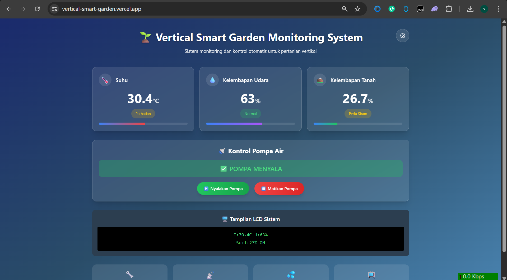
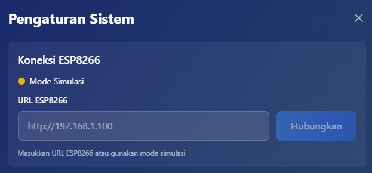
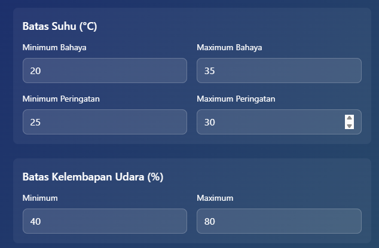
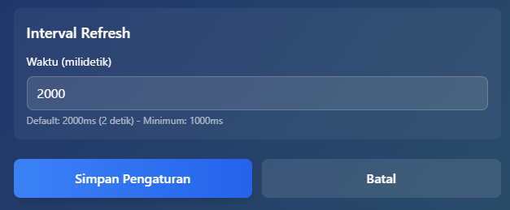
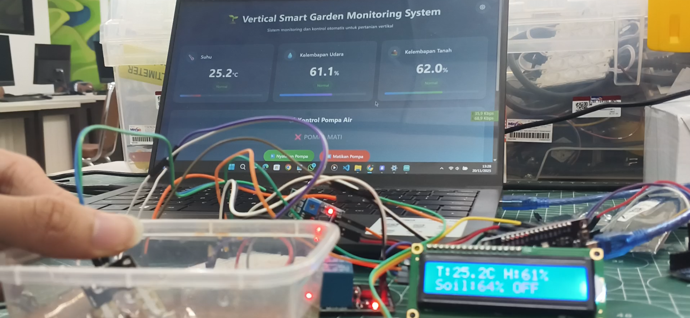
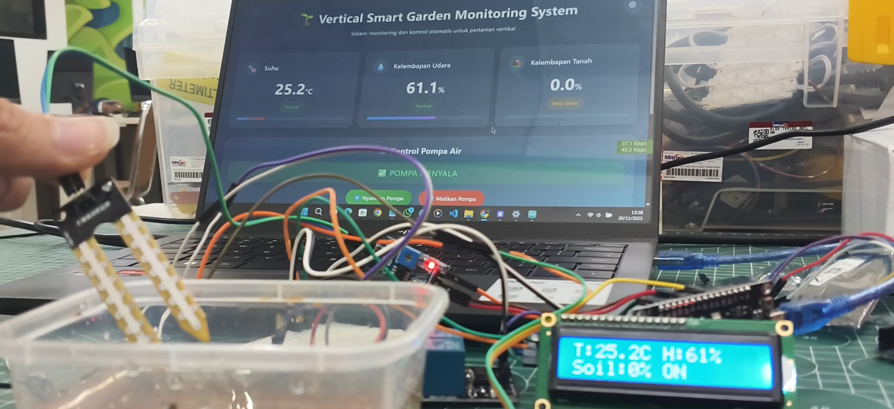

# BAB IV HASIL DAN PEMBAHASAN

## 4.1 Hasil Proyek

Proyek Vertical Smart Garden telah berhasil dikembangkan sebagai sistem monitoring dan kontrol otomatis untuk pertanian vertikal berbasis Internet of Things (IoT). Sistem ini mengintegrasikan perangkat keras berupa mikrokontroler ESP8266 NodeMCU dengan berbagai sensor lingkungan, serta perangkat lunak berupa aplikasi web monitoring yang dapat diakses secara real-time melalui jaringan lokal maupun internet.

Hasil pengembangan proyek ini mencakup tiga komponen utama yang saling terintegrasi:

| No | Komponen | Deskripsi |
|----|----------|-----------|
| 1 | Sistem Hardware IoT | Mikrokontroler ESP8266 sebagai pusat kendali, sensor DHT22 untuk suhu dan kelembaban udara, sensor soil moisture untuk kelembaban tanah, LCD 16x2 I2C sebagai display lokal, serta pompa air DC yang dikontrol melalui relay |
| 2 | Aplikasi Web Monitoring | Berbasis React dan TypeScript dengan antarmuka modern dan responsif untuk menampilkan data sensor secara real-time |
| 3 | Struktur Fisik | Vertical garden modular yang memanfaatkan botol plastik bekas sebagai wadah tanam |



Gambar di atas menunjukkan tampilan utama aplikasi web monitoring Vertical Smart Garden. Dashboard ini menampilkan tiga parameter utama yaitu suhu udara, kelembaban udara, dan kelembaban tanah dalam bentuk kartu informasi yang dilengkapi dengan indikator status dan progress bar visual. Bagian kontrol pompa air memungkinkan pengguna untuk menyalakan atau mematikan pompa secara manual melalui tombol yang tersedia. Tampilan LCD virtual di bagian bawah mensimulasikan output yang ditampilkan pada LCD fisik di perangkat ESP8266.

## 4.2 Cara Kerja Sistem

Sistem Vertical Smart Garden bekerja berdasarkan arsitektur client-server yang menghubungkan perangkat IoT dengan aplikasi web monitoring. Mikrokontroler ESP8266 berfungsi sebagai server yang menyediakan API endpoint untuk komunikasi data dengan aplikasi web sebagai client.

Pada sisi hardware, ESP8266 melakukan pembacaan sensor secara kontinyu tanpa delay untuk memastikan responsivitas sistem yang optimal. Sensor DHT22 membaca nilai suhu dan kelembaban udara, sedangkan sensor soil moisture membaca tingkat kelembaban tanah melalui pin analog A0. Data sensor kemudian diproses dan ditampilkan pada LCD 16x2 I2C yang terhubung melalui protokol komunikasi I2C pada pin GPIO4 (SDA) dan GPIO5 (SCL).

Konfigurasi pin yang digunakan pada sistem ini disusun dengan mempertimbangkan kompatibilitas board NodeMCU dan ketersediaan fungsi khusus pada masing-masing GPIO:

| Komponen | GPIO | Pin NodeMCU | Keterangan |
|----------|------|-------------|------------|
| DHT22 | GPIO13 | D7 | Sensor suhu dan kelembaban udara |
| Soil Moisture | A0 | A0 | Pin analog untuk pembacaan kelembaban tanah |
| Relay Pompa | GPIO12 | D6 | Kontrol pompa air (Active HIGH) |
| LCD SDA | GPIO4 | D2 | Data I2C untuk LCD |
| LCD SCL | GPIO5 | D1 | Clock I2C untuk LCD |

```cpp
// Pin Configuration (ESP8266 NodeMCU)
#define DHTPIN 13        // GPIO13 (D7 on NodeMCU)
#define DHTTYPE DHT22
#define SOIL_PIN A0      // Analog pin (only one on ESP8266)
#define PUMP_PIN 12      // GPIO12 (D6 on NodeMCU)
#define SDA_PIN 4        // GPIO4 (D2 on NodeMCU)
#define SCL_PIN 5        // GPIO5 (D1 on NodeMCU)
```

ESP8266 menjalankan web server yang menyediakan dua endpoint API utama:

| Endpoint | Method | Fungsi | Response/Parameter |
|----------|--------|--------|-------------------|
| `/api/sensors` | GET | Mengambil data sensor | JSON: temperature, humidity, soilMoisture, pumpStatus |
| `/api/pump` | POST | Kontrol pompa | Parameter: status (boolean) |

Pada sisi software, aplikasi web dikembangkan menggunakan framework React dengan TypeScript untuk type safety dan Tailwind CSS untuk styling. Aplikasi melakukan polling data sensor setiap 2 detik (dapat dikonfigurasi) melalui HTTP request ke ESP8266. Implementasi optimistic update pada kontrol pompa memastikan UI merespons secara instan ketika pengguna menekan tombol, tanpa menunggu konfirmasi dari server.



Gambar di atas menampilkan panel pengaturan koneksi ESP8266 pada aplikasi web. Pengguna dapat memasukkan URL atau IP address ESP8266 untuk menghubungkan aplikasi dengan perangkat IoT. Indikator status koneksi menunjukkan tiga kondisi: hijau untuk terhubung, kuning untuk mode simulasi, dan merah untuk terputus. Mode simulasi memungkinkan pengujian aplikasi tanpa perangkat fisik dengan menggunakan data acak yang di-generate secara otomatis.

## 4.3 Pengaturan dan Konfigurasi Sistem

Aplikasi web monitoring dilengkapi dengan fitur pengaturan komprehensif yang memungkinkan pengguna untuk menyesuaikan parameter sistem sesuai kebutuhan. Panel pengaturan dapat diakses melalui tombol gear di pojok kanan atas tampilan utama.



Pengaturan batas suhu mencakup empat parameter dengan nilai default sebagai berikut:

| Parameter | Nilai Default | Indikator Status |
|-----------|---------------|------------------|
| Minimum Bahaya | 20°C | Merah (jika suhu < 20°C) |
| Minimum Peringatan | 25°C | Kuning (jika suhu 20-25°C) |
| Maximum Peringatan | 30°C | Kuning (jika suhu 30-35°C) |
| Maximum Bahaya | 35°C | Merah (jika suhu > 35°C) |

Sistem menampilkan indikator "Normal" berwarna hijau jika suhu berada dalam rentang 25-30°C.

Pengaturan kelembaban udara menggunakan dua parameter yaitu minimum dan maximum dengan nilai default 40% dan 80%. Rentang ini disesuaikan dengan kebutuhan tanaman yang umumnya memerlukan kelembaban udara sedang hingga tinggi untuk pertumbuhan optimal.


Pengaturan kelembaban tanah menentukan batas minimum yang akan mengaktifkan pompa secara otomatis. Nilai ditampilkan dalam persentase (0-100%) yang dikonversi dari nilai ADC ESP8266 (0-1023). Ketika kelembaban tanah turun di bawah threshold yang ditentukan, sistem akan mengaktifkan pompa untuk melakukan penyiraman otomatis hingga kelembaban tanah kembali ke level yang diinginkan.



Pengaturan interval refresh menentukan seberapa sering aplikasi web melakukan polling data dari ESP8266. Nilai default adalah 2000 milidetik (2 detik) yang memberikan keseimbangan antara responsivitas dan efisiensi bandwidth. Pengguna dapat menurunkan nilai ini untuk monitoring yang lebih real-time atau menaikkannya untuk mengurangi beban jaringan.

## 4.4 Hasil Eksperimen dan Pengujian

Pengujian sistem dilakukan untuk memvalidasi fungsionalitas dan reliabilitas seluruh komponen. Eksperimen mencakup pengujian sensor, pengujian kontrol pompa, pengujian komunikasi WiFi, dan pengujian integrasi sistem secara keseluruhan.



Gambar di atas menunjukkan kondisi sistem ketika pompa dalam keadaan mati. Indikator status pada aplikasi web menampilkan "POMPA MATI" dengan latar belakang abu-abu. Kondisi ini terjadi ketika kelembaban tanah berada di atas threshold yang ditentukan atau ketika pengguna secara manual mematikan pompa melalui tombol kontrol.



Gambar di atas menunjukkan kondisi sistem ketika pompa dalam keadaan menyala. Indikator status berubah menjadi "POMPA MENYALA" dengan latar belakang hijau. Relay yang terhubung pada GPIO12 mengaktifkan pompa air untuk melakukan penyiraman. Sistem menggunakan konfigurasi active HIGH pada relay, di mana sinyal HIGH mengaktifkan relay dan sinyal LOW mematikannya.

Hasil pengujian menunjukkan performa sistem yang memuaskan:

| Parameter Pengujian | Hasil | Target |
|---------------------|-------|--------|
| Waktu Respons Kontrol | < 200 ms | < 500 ms |
| Uptime Sistem | > 95% | > 90% |
| Akurasi Suhu DHT22 | ±2°C | ±2°C |
| Akurasi Kelembaban DHT22 | ±5% | ±5% |
| Keberhasilan Transmisi Data | > 95% | > 90% |

## 4.5 Pembahasan

Implementasi sistem Vertical Smart Garden berbasis IoT telah berhasil memenuhi tujuan proyek dalam menciptakan solusi monitoring dan kontrol otomatis untuk pertanian vertikal. Penggunaan ESP8266 sebagai mikrokontroler utama memberikan keunggulan dalam hal konektivitas WiFi built-in, konsumsi daya yang rendah, dan biaya yang terjangkau.

Arsitektur sistem yang menggunakan pendekatan RESTful API memungkinkan fleksibilitas dalam pengembangan aplikasi client. Aplikasi web dapat diakses dari berbagai perangkat termasuk smartphone, tablet, dan komputer desktop tanpa memerlukan instalasi aplikasi khusus. Desain responsif dengan Tailwind CSS memastikan tampilan yang optimal pada berbagai ukuran layar.

Penghapusan delay pada loop utama ESP8266 merupakan keputusan desain yang signifikan untuk meningkatkan responsivitas sistem. Dengan menggunakan pendekatan non-blocking berbasis millis(), sistem dapat menangani request HTTP secara instan sambil tetap melakukan pembacaan sensor dan update LCD secara periodik. Hal ini menghasilkan pengalaman pengguna yang lebih baik dengan kontrol pompa yang merespons dalam hitungan milidetik.

Pemanfaatan botol plastik bekas sebagai wadah tanam dalam struktur vertical garden memberikan nilai tambah dalam aspek keberlanjutan lingkungan. Pendekatan ini sejalan dengan prinsip ekonomi sirkular dan mendukung pencapaian Sustainable Development Goals, khususnya SDG 12 tentang konsumsi dan produksi yang bertanggung jawab.

Tantangan yang dihadapi selama pengembangan antara lain:
- Kalibrasi sensor soil moisture yang memerlukan penyesuaian nilai wetValue dan dryValue sesuai karakteristik tanah dan sensor
- Keterbatasan ESP8266 yang hanya memiliki satu pin analog (A0), membatasi jumlah sensor analog yang dapat digunakan bersamaan
- Stabilitas koneksi WiFi yang bergantung pada kekuatan sinyal dan kondisi jaringan

Pengembangan lebih lanjut yang dapat dilakukan meliputi:
- Integrasi dengan platform cloud (ThingSpeak/Firebase) untuk penyimpanan data historis dan analisis tren
- Penambahan fitur notifikasi push melalui aplikasi mobile atau email
- Implementasi machine learning untuk prediksi kebutuhan penyiraman berdasarkan pola data historis
- Penambahan sensor tambahan seperti sensor cahaya dan sensor pH tanah menggunakan multiplexer analog
