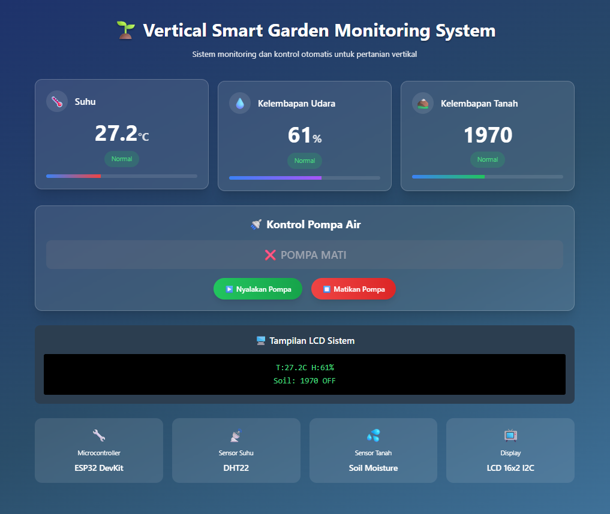

# Smart Garden Monitoring System




A modern, real-time web dashboard for monitoring and controlling vertical farming systems. Built with React, TypeScript, and Tailwind CSS, this application provides an intuitive interface for tracking environmental conditions and automating irrigation systems.

## Features

### Real-Time Monitoring
- **Temperature Tracking** - Monitor ambient temperature with visual indicators and status alerts
- **Humidity Monitoring** - Track air humidity levels with real-time updates
- **Soil Moisture Detection** - Measure soil moisture content with analog sensor readings
- **Live Data Updates** - Automatic data refresh every 3 seconds

### Automated Control
- **Smart Irrigation** - Automatic pump activation based on soil moisture thresholds
- **Manual Override** - Direct pump control with on/off buttons
- **Status Indicators** - Visual feedback for all system states

### User Interface
- **Glassmorphism Design** - Modern UI with backdrop blur effects
- **Responsive Layout** - Optimized for desktop and mobile devices
- **Interactive Cards** - Hover effects and smooth transitions
- **Progress Bars** - Visual representation of sensor readings
- **LCD Display Simulation** - Retro-style system status display

## Hardware Components

| Component | Model | Purpose |
|-----------|-------|---------|
| Microcontroller | ESP32 DevKit | Main processing unit |
| Temperature & Humidity Sensor | DHT22 | Environmental monitoring |
| Soil Moisture Sensor | Capacitive Analog | Soil water content detection |
| Display | LCD 16x2 I2C | Local status display |
| Relay Module | 5V Single Channel | Pump control |

## Technology Stack

- **Frontend Framework**: React 19.1.1
- **Language**: TypeScript 5.9.3
- **Build Tool**: Vite 7.1.11
- **Styling**: Tailwind CSS 3.4.0
- **State Management**: React Hooks (useState, useEffect)

## Getting Started

### Prerequisites

- Node.js (v18 or higher)
- npm or yarn package manager

### Installation

1. Clone the repository
```bash
git clone https://github.com/yourusername/verticalsmartgarden.git
cd verticalsmartgarden
```

2. Install dependencies
```bash
npm install
```

3. Start the development server
```bash
npm run dev
```

4. Open your browser and navigate to `http://localhost:5173`

### Build for Production

```bash
npm run build
```

The optimized production build will be generated in the `dist` directory.

### Preview Production Build

```bash
npm run preview
```

## Project Structure

```
verticalsmartgarden/
├── src/
│   ├── App.tsx           # Main application component
│   ├── main.tsx          # Application entry point
│   ├── index.css         # Global styles with Tailwind
│   └── App.css           # Component-specific styles
├── public/               # Static assets
├── index.html            # HTML template
├── tailwind.config.js    # Tailwind configuration
├── postcss.config.js     # PostCSS configuration
├── vite.config.ts        # Vite configuration
└── tsconfig.json         # TypeScript configuration
```

## Configuration

### Sensor Thresholds

Modify the threshold values in `src/App.tsx`:

```typescript
// Temperature status thresholds
const getTemperatureStatus = () => {
  if (sensorData.temperature < 20 || sensorData.temperature > 35) return 'danger'
  if (sensorData.temperature < 25 || sensorData.temperature > 30) return 'warning'
  return 'normal'
}

// Soil moisture threshold for pump activation
const getSoilStatus = () => {
  return sensorData.soilMoisture < 1500 ? 'warning' : 'normal'
}
```

### Update Interval

Change the data refresh rate (default: 3000ms):

```typescript
useEffect(() => {
  const interval = setInterval(() => {
    // Update logic
  }, 3000) // Modify this value
  
  return () => clearInterval(interval)
}, [])
```

## API Integration

Currently, the application uses simulated data. To connect to real hardware:

1. Set up an ESP32 with appropriate sensors
2. Create a REST API or WebSocket endpoint on the ESP32
3. Replace the simulation logic in `useEffect` with API calls:

```typescript
useEffect(() => {
  const fetchData = async () => {
    const response = await fetch('http://your-esp32-ip/api/sensors')
    const data = await response.json()
    setSensorData(data)
  }
  
  const interval = setInterval(fetchData, 3000)
  return () => clearInterval(interval)
}, [])
```

## Development

### Available Scripts

- `npm run dev` - Start development server
- `npm run build` - Build for production
- `npm run preview` - Preview production build
- `npm run lint` - Run ESLint

### Code Style

This project uses ESLint for code quality. Run linting before committing:

```bash
npm run lint
```

## Browser Support

- Chrome (latest)
- Firefox (latest)
- Safari (latest)
- Edge (latest)

## Contributing

Contributions are welcome! Please follow these steps:

1. Fork the repository
2. Create a feature branch (`git checkout -b feature/AmazingFeature`)
3. Commit your changes (`git commit -m 'Add some AmazingFeature'`)
4. Push to the branch (`git push origin feature/AmazingFeature`)
5. Open a Pull Request

## License

This project is licensed under the MIT License - see the LICENSE file for details.

## Acknowledgments

- ESP32 community for hardware documentation
- Tailwind CSS for the utility-first CSS framework
- React team for the excellent frontend library

## Contact

Project Link: [https://github.com/yourusername/verticalsmartgarden](https://github.com/yourusername/verticalsmartgarden)

---

**Note**: This is a demonstration project. For production use with real hardware, implement proper error handling, security measures, and data validation.
